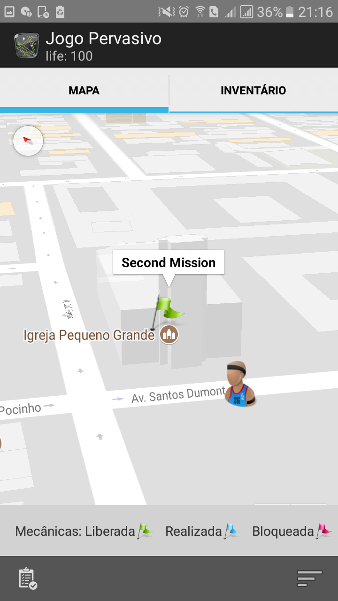

# LeGaL Core

## Implementation of NCL Extensions

LeGaL is a declarative language. It is based on the NCL entity concept and has an XML representation. It also inherits the NCL flexibility for temporal synchronism definition. The layout of LeGaL components resembles an NCL document structure. A LeGaL document can be translated into a directed nested graph, where nodes and edges are used to describe LBGs concepts presented in Section~\ref{subsec:game-model}. As we stated, LeGaL is designed for the extension of NCL documents enabling them to model LBGs. In fact, it describes the structure of these games. Thus, the resulting graph of this model represents missions that players must accomplish in an LBG. The graph also includes the composition of missions (media with which the player interacts) and the relationships between the missions and media files. It introduces the game flow, from its inception to its accomplishment. LeGaL graphs use two types of nodes: \textbf{context nodes} (composite nodes), and \textbf {media nodes}. The former represents nesting of nodes in the graph and the latter describes the associated media files. The edges of the graph represent the relationships between the nodes, i.e., the game flow. In LeGaL, ordering and time synchronisation between nodes are defined by the connectors and links.

LeGaL inherits several key NCL and NCM 3.0~\cite{soares2005nested} concepts such as nodes, links, and connectors. For the in-depth understanding of these definitions, the complete NCL documentation can be accessed at NCL Website (http://www.ncl.org.br/en).

There are some new attributes and extensions done to NCL in order to support the modelling of LBGs. This document shows some of these new features.

## Important Links

- [Get Started](./pages/getting-started.md)
- [LeGaL Presentations](https://github.com/LeGaLProject/LeGaLPresentations)
- [Examples using LBG Patterns](https://github.com/LeGaLProject/GamePatternExamples)
- [Evaluation with Developers](./pages/developer-evaluation.md)

## Extensions

- [Mission Properties](#mission-properties)
- [Game Action and Score](#game-action-and-score)
- [Spatial Data and Relationships](#spatial-data-and-relationships)
- [Augmented Reality Media](#augmented-reality-media)
- [XML Representation](#xml-representation)

### Mission Properties

We add some properties to the context node for representing mission information. For instance, the number of times a mission can be played, which missions are required to be played before playing the others, and others. In example below, we show the use of these properties for the running example description. The occurrence property defines the msSecondChurch mission can be played as many times as the player wants, the mandatory property says the mission is mandatory to finish the game and the visibility sets the mission is always visible to the player. Table contains four of these properties and its possible values.

#### Configurable Props

- [mandatory](#mandatory)
- [occurrence](#occurrence)
- [visibility](#visibility)
- [requirements](#requirements)

| Property     | Values           | Description                                      |
| ------------ | ---------------- | ------------------------------------------------ |
| mandatory    | true or false    | Defines whether a mission is mandatory.          |
| occurrence   | positive integer | Sets how many times the mission can be executed. |
| visibility   | true or false    | Indicates if a mission can be executed.          |
| requirements | list of values   | Stores a list of required missions.              |

Example:

```xml
<context id="msSecondChurch">
  <port id="pSecondChurch" component="locSecondChurch"/>
  <property name="mandatory" value="true"/>
  <property name="occurrence" value="unbounded"/>
  <property name="visibility" value="true"/>

  <media id="locSecondChurch" type="application/gml+xml" src="media/secondChurch.gml"/>
  <media id="mdVideo" type="video/3gpp" src="media/thirdChurchIndicator.3gp"/>
</context>
```

### Game Action and Score

There are four types of actions supported by LeGaL: execute, create, collect, and drop media. We can use the action property to store the desired action when defining a media. The property receives an integer value between 0 and 3 representing the corresponding action. In example above, we don't explicitly set this property in the mdVideo media code, so it assumes the value 0 (execute) by default. The execute action consists of exhibiting one or more media, such as playing an audio or video, displaying a text or visualising a 3D object. The create action allows players to create their own game media, like images and videos. Additionally, the drop media action enables players to place a media in a determined location and the collect action allow players to collect media placed in a specific location. Table below presents each value.

#### Configurable Props

- [action](#action)
- [score](#score)

| Value       | Description     |
| ----------- | --------------- |
| execute (0) | Run a media.    |
| collect (1) | Catch a media.  |
| create (2)  | Create a media. |
| drop (3)    | Drop a media.   |

Example:

```xml
<media id="mdImage" ... >
  <property name="action" value="execute"/> ...
</media>
```

At runtime, a player is rewarded with a score for every mission or action completed. The same actions presented in Section~\ref{subsubsec:actions} can have a matching reward. To implement such system, a score property was added to missions and media, thus defining the reward for each action executed by the players. This parameter can assume positive integer values.

Example:

```xml
<context id="msFirst" ... >
  <property name="score" value="30"/> ...
</context>
```

### Spatial Data and Relationships

In the proposed language, a media node has information about the location of game missions. The node type is application/gml+xml and consists of a GML (Geography Markup Language) with ".gml" extension. GML~\cite{cox2002opengis} is an XML extension developed to express geographic features. The extension uses points, lines, polygons and geometric shapes defined by Cartesian coordinates and associated with spatial reference systems. LeGaL uses GML to specify activation areas for a game mission, thus being able to describe a polygon representing a mission's location.

Location code example below illustrates a media node representing the msSecondChurch mission location (i.e., in the city centre of Fortaleza, Brazil):

```xml
<media id="locSecondChurch" type="application/gml+xml" src="media/secondChurchChurch.gml"/>
```

 

GML code example below describes the locSecondChurch node, which represents a circular area with a radius and coordinates of the place as the centre point:

```xml
<?xml version="1.0" encoding="utf-8" ?>
<gml:CircleByCenterPoint ...>

  <gml:pos srsName="urn:ogc:def:crs:OGC:1.3:CRS84">-38.523074 -3.7279587</gml:pos>
  <gml:radius uom="m">20</gml:radius>

</gml:CircleByCenterPoint>
```

#### Events

- [onEntering](#onEntering)
- [onLeaving](#onLeaving)
- [onStaying](#onStaying)

The location of players and missions' activation areas is key to the gameplay of LBGs. In this work, an activation area is a planar region defined bi-dimensional coordinates. These areas can be defined as regular or irregular polygons, and circles. The spatial relation between activation areas is the foundation to the RCC (Region Connection Calculus}~\cite{randell1992spatial}. In LeGaL, we have used this definition to create a relation between the player's location and the game map activation areas. We added a set of events to LeGaL, which can be linked to media nodes: onEntering, onLeaving, and onStaying. onEntering is triggered when a player enters the activation area of a mission. Conversely, onLeaving is launched when a player exits an activation area. Finally, onStaying is triggered if a player remains in an activation area during a determined time.

Examples below show examples of connectors and links for the running example, respectively. In this case, a media is executed when a player enters an activation area of the second church:

```xml
<casualConnector xconnector="onEnteringStart">
  <simpleCondition role="onEntering"/>
  <simpleAction role="start"/>
</casualConnector>
```

```xml
<link xconnector="space#onEnteringStart">
  <bind role="onEntering" component="locSecondChurch"/>
  <bind role="start" component="mdVideo"/>
</link>
```

### Augmented Reality Media

LeGaL supports the use of media nodes to represent Augmented Reality (AR) content in games. In this case, it is necessary to specify a ".obj" file containing the points of a 3D object, a ".mtl" file describing information about the surface of the object, and optionally a ".png" file containing a texture to be applied to the 3d model.

#### Configurable Props

- [mtlFile](#mtlFile)
- [texture](#texture)

Example below illustrates a media node defining an AR object in the game. The media node uses the src parameter to specify the ".obj" file and the other files are specified using two distinct properties:

```xml
<media id="mdThirdChurch" type="text/plain" src="media/treasure.obj">
  <property name="mtlFile" value="media/treasure.mtl"/>
  <property name="texture" value="media/treasure.jpg"/>
</media>
```

### XML Representation

The textual representation of LeGaL is an XML document. The block structure defines the grouping of language components. As in an NCL application, the document must have a definition header (`<ncl>`), a program header (`<head>`), a program body (`<body>`), and the closing of the document (`</ncl>`). The elements `<head>` and `<body>` must be declared as children of the `<ncl>` element. Definitions of descriptors and connectors are made in the document header, in their respective code blocks. Context and media nodes, links, and other components are defined in the body of the game document. NCL language tokens are used in the definition of the LeGaL document to describe the components and the behaviour of the game. Table below summarises the document components, belonging to NCL, which are used in our extension.

| Element          | Token              | Parameters                                                     |
| ---------------- | ------------------ | -------------------------------------------------------------- |
| Media node       | `<media>`          | id, type, scr, descriptor                                      |
| Context node     | `<context>`        | id, mandatory, times, visibility, requirements                 |
| Connectors base  | `<connectorBase>`  | id                                                             |
| Connector        | `<connector>`      | id, condition, action                                          |
| Link             | `<link>`           | id, xconnector                                                 |
| Bind             | `<bind>`           | component, interface, role, delay                              |
| Port             | `<port>`           | id, component                                                  |
| Anchor           | `<area>`           | id, begin, end                                                 |
| Descriptors base | `<descriptorBase>` | id                                                             |
| Descriptor       | `<descriptor>`     | id, duration, opacity, volume, fontSize, fontColor, fontWeight |

First, the game developer must specify the GML document, which contains geolocation points related to the missions. Then, he should define the descriptors, which detail how the game media will execute. After this step, the connectors and links are identified, and then the media must be specified. The next step is to set the ports for the flow composition of the game missions.

Code below exemplifies the basic document structure that LeGaL uses to specify an LBG:

```xml
<?xml version="1.0" encoding="ISO-8859-1"?>
<ncl id="" xmlns="http://www.ncl.org.br/NCL3.0/EDTVProfile">
  <head>
    <descriptorBase ...> <!--descriptors--> </descriptorBase>
    <connectorBase ...> <!--connectors--> </connectorBase>
  </head>
  <body>
    <port .../> <!--initial ports-->
    <context ...> <!--missions-->
      <port .../>
      <media ...> ... </media> <!--media objects-->
      ... <!--relationships between mission media--> ...
    </context>
    ... <!--relationships between missions--> ...
  </body>
</ncl>
```
