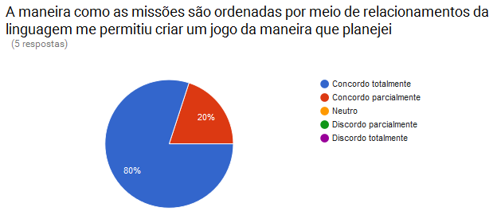

# Evaluating LeGaL with Developers

Here we have some graphics and photos as result of a evaluation performed with NCL developers.

**Users**: Five NCL developers  
**Date**: February 16, 2017  
**Local**: Federal University of Maranhão, São Luis, MA, Brazil  

## Some photos

  
  
  
 

## About the Proposed Acivity

In this experiment, we conducted a usability experiment with NCL specialists to measure the ease of use of our extension with developers who already know the main elements of NCL. We started our evaluation by presenting to the users the main LBG elements and mechanics (see the [presentation](https://github.com/LeGaLProject/LeGaLPresentations/blob/master/2017_02_slides_developers_evaluation.pdf)).

Then, we invite the testers to perform two activities:

`First activity`: The player would visit three places, in each place the player visualizes a media. The game ends when the player visits the third location.

- Church: a video
- Hospital: an image
- Park: an AR object

Access the codes of the first activity in: [User 1](../docs/code-user1-activity1.ncl) | [User 2](../docs/code-user2-activity1.ncl) | [User 3](../docs/code-user3-activity1.ncl) | [User 4](../docs/code-user4-activity1.ncl) | [User 5](../docs/code-user5-activity1.ncl)

`Second activity`: The game has two teams (A and B), in which each team consists of a player. Team A should visit the church and then the castle. Team B should visit the hospital and then the castle. Whoever arrives first in the castle wins the game.

- Church: an image
- Hospital: an audio
- Castelo: a video

Access the codes of the second activity in: [User 1](../docs/code-user1-activity2.ncl) | [User 2](../docs/code-user2-activity2.ncl) | [User 3](../docs/code-user3-activity2.ncl) | [User 4](../docs/code-user4-activity2.ncl) | [User 5](../docs/code-user5-activity2.ncl)

## Some graphics

### From the first questionnaire

Access in [Portuguese](goo.gl/L5ADu8) or [English](goo.gl/dWxWw1).

 
 
 
 
 

### From the second questionnaire

Access in [Portuguese](goo.gl/1111OX) or [English](goo.gl/LRdcn7).

 
 
 
 
 
 

### From the third questionnaire

Access in [Portuguese](goo.gl/XG8aYl) or [English](goo.gl/mBKKyQ).

 
 
 
