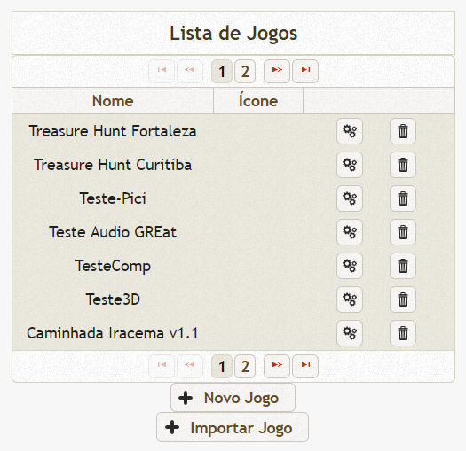
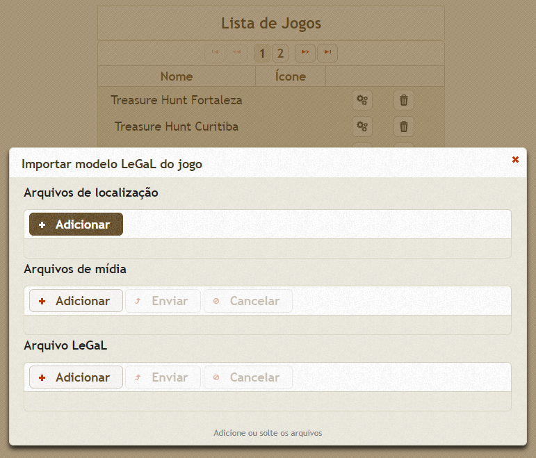
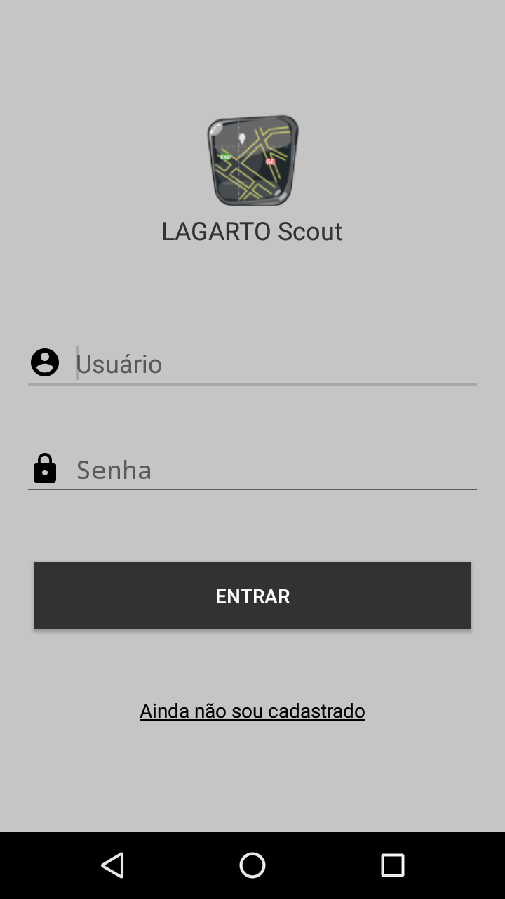
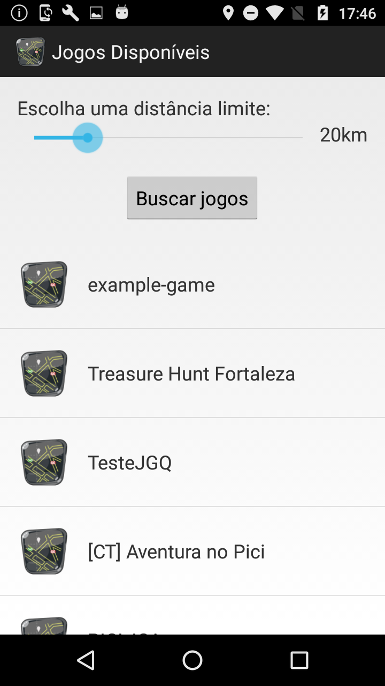
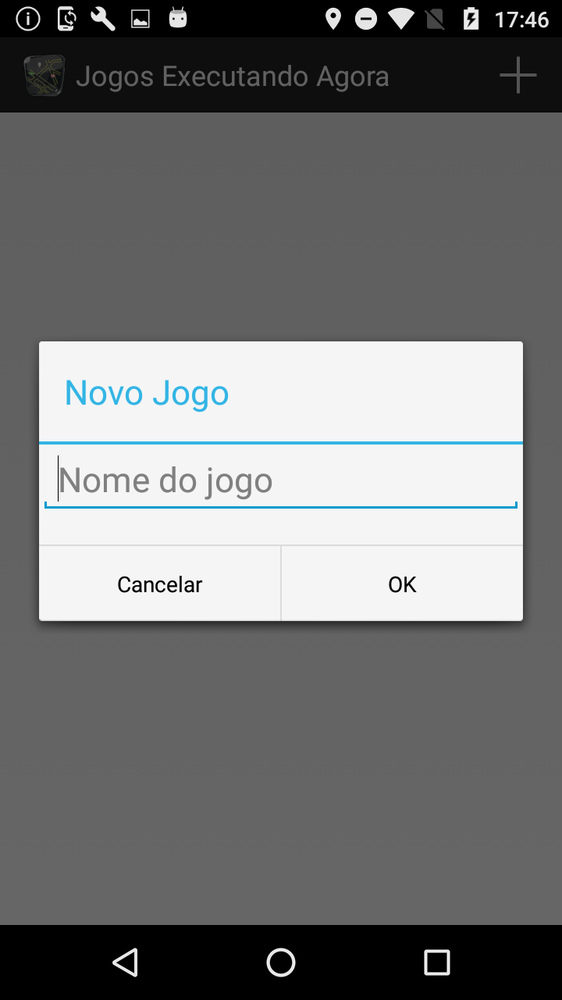
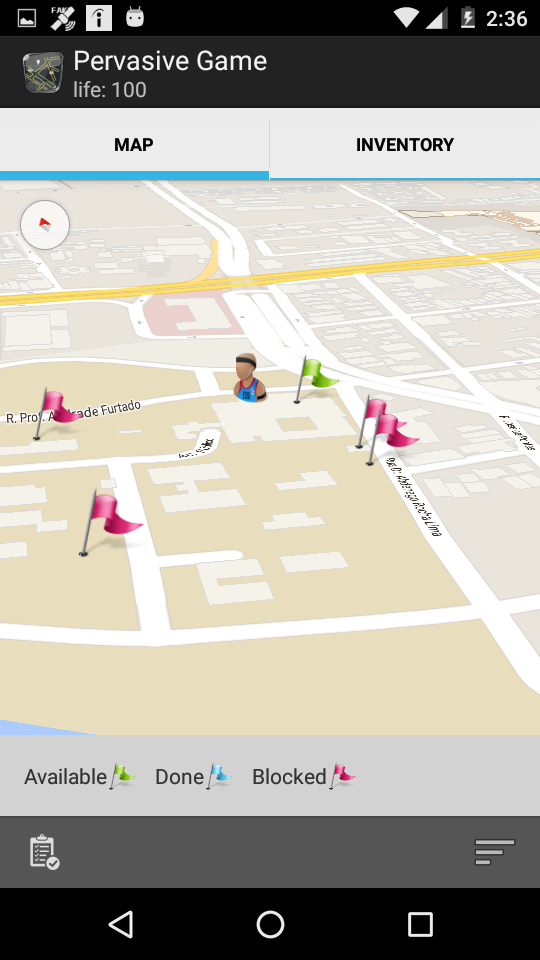

# Getting Started

This page will help you install and build your first LBG using LeGaL.

## Setup

1. Install the [Eclipse IDE](https://www.eclipse.org/downloads/) or any any text editor of your choice
1. Assuming that you have Eclipse installed, you can use [NCL Eclipse Plug-in](http://www.telemidia.puc-rio.br/~roberto/ncleclipse) to make development easier
1. Generate media and model files (check the files supported by LAGARTO [here](../docs/lagarto-technical-specifications-of-supported-media.pdf))

## Importing LBG to LAGARTO tool

In this step, you will import the game and publish it. So the game will be available to players.

1. Access LAGARTO tool
2. Login and click in `Import Game` button in the Game List screen

 

3. In `Import Model` screen, first, add location files (.gml)
4. Then, add media files (.png, .mp3, etc)
5. And then, add the model file (.ncl)
6. In `Game List` screen, click on `Edit` button
7. Publish the LBG

## Running the LBG

1. Download LAGARTO Scout APP from PlayStore, for now available only for Android
2. Login in the APP

   

3. Choose the game created in the list of `Available Games`
4. Join an instance of the game or create a new one
5. And start the game

### That's it!
